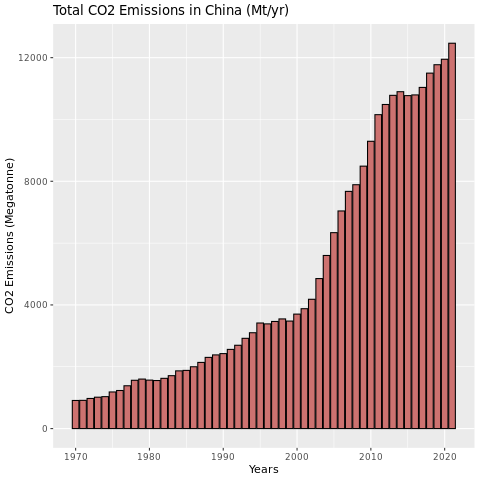
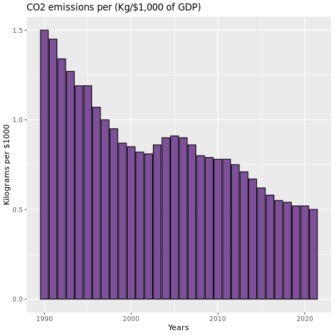
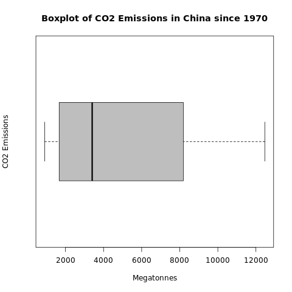

## What Was The Purpose?
The purpose of this analysis is to use the `CN_CHINA.csv` dataset to get useful information about CO2 emissions in China, during the years 1970-2021.

## How Did You Do It?
All analysis was done using the **R programming language**, and one library called **ggplot2**.

### Running instructions

The R script is found in the `data-analysis/CO2-emissions-analysis` folder.

The only prerequisite to run this is to have R installed, and add the **ggplot2** library:
```R
install.packages(ggplot2)
```

If you have R installed and this package added, you can run it with the command:

```bash
Rscript CO2-analysis-script.R
```


## What Was The Results?

#### Summary
I found that the CO2 emissions in China have been rising over the last several decades. Although it has been steadily increasing, there are no current outliers.  Predicting any future changes, I was able to statistically compute about a 240 megatonne increase in the amount of CO2 emissions yearly, on average.

Based on the research below, China will continue to emit more CO2 each year at a steady rate.


#### Research

##### Total emissions since 1970



On a surprising note, the kilograms of CO2 emissions per $1000 of GDP has been decreasing.

##### Kilograms of CO2 emissions per $1,000 of GDP



Regarding any outliers, no particular year produced unusually more or less emissions, seen in the absence of any outliers in the boxplot below.

##### Boxplot to show any outliers



The mean of the total emissions is 4873.06. However, this is a simple calculation and is actually not the most reliable. Using a t-test in **R**, I was able to calculate that the true mean of total emissions from this sample is actually between 3800.937 and 5945.184.

##### T-test to show true mean
```R
        One Sample t-test

data:  content$co2_total_megatonne
t = 9.125, df = 51, p-value = 2.66e-12
alternative hypothesis: true mean is not equal to 0
95 percent confidence interval:
 3800.937 5945.184
sample estimates:
mean of x 
  4873.06 
```


With regard to the yearly increase of CO2 in China, using a linear model I was able to determine that each year is expected to have about 238.4 megatonnes more CO2.

##### Linear model
```R
Call:
lm(formula = content$co2_total_megatonne ~ content$year)

Coefficients:
 (Intercept)  content$year  
   -470819.0         238.4 
```


The quantile ranges for the data can also be calculated in R

##### Quantiles
```R
       0%       25%       50%       75%      100% 
  909.573  1690.124  3401.413  8039.383 12466.316
```